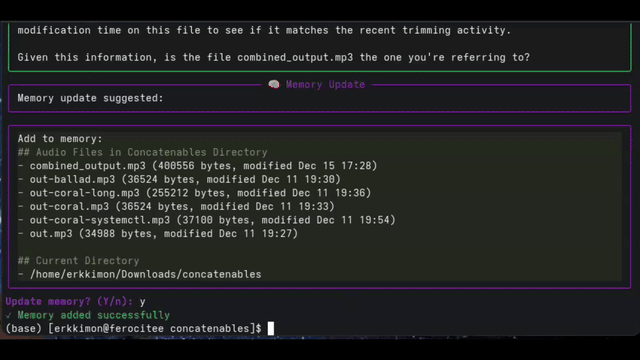

# AISH ­&ndash; inline AI agent for devops

AISH is the world's first context-aware inline devops sh agent. It is local-first but works also with any commercial OpenAI compatible LLM. Delegate shell tasks to aish who lives in the terminal. You can do in-line chatting with aish. Just mention `@aish` and send a request and `@aish` will complete it for you.



*This demo was created using Devstral-2505 24B Q4 running on [vllama](https://github.com/erkkimon/vllama) which is world's fastest drop-in replacement for ollama.*

## 🚀 Features

- **In-line Chatting**: Tag `@aish` anywhere in your terminal session for instant assistance, and it works on any bash terminal including SSH
- **Context Awareness**: aish sees your bash session without initiating agentic sessions and can reference previous commands and outputs
- **Interactive Command Execution**: Approve, deny, or comment on proposed commands before execution
- **Memory System**: Persistent memory that learns your preferences and environment details across sessions
- **Smart Model Selection**: Automatic model discovery from your LLM endpoint during setup
- **Rich Terminal UI**: Beautiful, colorized output with panels and syntax highlighting
- **Local-First Design**: Works with local LLM runners (Ollama, vLLama) or commercial OpenAI compatible APIs
- **Bash Session Logging**: Optional real-time session recording for review and sharing
- **Question Detection**: Automatically detects when aish asks questions and provides interactive responses

## 📦 Installation

**Prerequisites:**
- Python 3.12+
- A running OpenAI-compatible LLM endpoint. `aish` is designed with a local-first approach, compatible with local LLM runners like [vLLaMA](https://github.com/erkkimon/vllama) and [Ollama](https://github.com/ollama/ollama). It also works with OpenAI and any other OpenAI-compatible API.

**Quick Install:**
```bash
git clone https://github.com/erkkimon/aish ~/Software/aish
cd ~/Software/aish
bash setup.sh
```

The setup script will:
1. Create a Python virtual environment automatically
2. Install all required dependencies
3. Set up the `@aish` command in your `~/.bashrc`
4. Discover available models from your endpoint and let you choose interactively
5. Create a user configuration file at `~/.aish/config.yaml`

After installation, restart your terminal or run `source ~/.bashrc` to start using `@aish`.

## 🎯 Usage

### Basic Usage
To run the agent, use the `@aish` alias with your command as arguments:

```bash
@aish show me all Python files in this directory
```

### Context-Aware In-line Chatting

aish is context-aware and can see your recent terminal history. This enables powerful in-line conversations:

**Example 1: Analyzing file permissions**
```bash
$ ls -la
total 24
drwxr-xr-x  5 user user 4096 Dec 14 10:23 .
drwxr-xr-x 18 user user 4096 Dec 14 09:15 ..
-rw-r--r--  1 user user  220 Dec 14 10:20 config.yaml
-rwxr-xr-x  1 user user  450 Dec 14 10:15 setup.sh
-rw-r--r--  1 user user 1200 Dec 14 10:10 README.md

$ @aish do those file permissions look okay?
🤖 Plan: I'll check the file permissions from your ls output and analyze if they look correct.
🛠️ Command: echo "Analyzing permissions..."
Execute? (Y/n/c):
```

**Example 2: Working with command output**
```bash
$ find . -name "*.log" -size +10M
./logs/app.log
./logs/debug.log

$ @aish compress those large log files
🤖 Plan: I'll compress the large log files you found to save disk space.
🛠️ Command: gzip ./logs/app.log ./logs/debug.log
Execute? (Y/n/c): y
✓ Command executed successfully
```

**Example 3: Debugging after errors**
```bash
$ python script.py
Traceback (most recent call last):
  File "script.py", line 15, in <module>
    process_data()
  File "script.py", line 8, in process_data
    result = 10 / 0
ZeroDivisionError: division by zero

$ @aish fix that error
🤖 Plan: I can see the ZeroDivisionError in your script. Let me examine the file and fix the division by zero issue.
🛠️ Command: sed -i 's/10 \/ 0/10 \/ 1/g' script.py
Execute? (Y/n/c): c
💬 Comment: Actually, check what the correct divisor should be
🤖 Plan: You're right, let me first examine the script to understand the context...
```

### Interactive Controls

When aish proposes a command, you can:
-   `y` or `Enter`: Execute the command
-   `n`: Stop the agent
-   `c`: Provide a comment to revise the agent's plan

### Memory Management

aish has persistent memory that stores **system state** - durable facts about your environment:

```bash
$ @aish remember that I prefer vim over nano
🧠 Memory Update: Added preference
✓ Memory updated successfully

$ @aish open that config file
🛠️ Command: vim config.yaml   # aish remembers your preference!
```

The memory stores current facts, not history:
- **User preferences**: "prefers vim, uses 4-space indentation"
- **System configuration**: "nginx installed, serves /var/www/html"
- **Project conventions**: "uses Python 3.11 with poetry"
- **Custom setups**: "backup script at ~/scripts/backup.sh"

### Interactive Programs

aish properly handles interactive terminal programs. When you ask to open files in vim, less, htop, etc., they run with full terminal access:

```bash
$ @aish open the log file in vim
🛠️ Command: vim /var/log/app.log
Execute? (Y/n/c): y
# vim opens normally with full interactivity
```

Supported interactive programs: vim, nano, less, htop, man, ssh, tmux, and more.

## ⚙️ Configuration

`aish` is configured via a `config.yaml` file. The setup script automatically creates one for you at `~/.aish/config.yaml`.

**Configuration options:**
-   `model`: The name of the model to use at your endpoint
-   `endpoint_url`: The URL for the chat completions API
-   `api_key`: Optional API key if your service requires authentication

During setup, aish will:
1. Connect to your endpoint URL
2. Fetch available models automatically
3. Present an interactive menu to select your preferred model
4. Configure everything automatically

### Supported Providers

- **Local LLMs**: Ollama, vLLaMA, LocalAI, and other OpenAI-compatible servers
- **Commercial APIs**: OpenAI, Kimi Code API, and other OpenAI-compatible providers

For **Kimi Code API**, use:
- Endpoint: `https://api.kimi.com/coding/v1`
- Model: `kimi-for-coding`
- API key from your Kimi membership page

## 📝 Bash Session Logging (Optional)

AISH includes optional bash session logging that creates a real-time carbon copy of your terminal session. This enables aish to be truly context-aware.

**To enable bash session logging:**

1. Add this line to your `~/.bashrc`:
   ```bash
   source ~/Software/aish/bashrc_extension_aish.sh
   ```

2. Restart your terminal

The logging automatically creates session files in `~/.local/share/bash_sessions/` and cleans up files older than 7 days.

**Note:** The logging functionality is completely separate from the `@aish` command and can be used independently.

## 🔄 Updating aish

To update `aish` to the latest version:
```bash
cd ~/Software/aish
bash setup.sh  # This will update paths and configuration
```

Or manually:
```bash
cd ~/Software/aish
git pull
pip install -r requirements.txt
```

## 🛠️ How It Works

- **`setup.sh`** - Automated installation script that sets up everything including model discovery
- **`aish.py`** - Main AI assistant with rich terminal UI and memory management
- **`bashrc_extension_aish.sh`** - BASH session logging for context awareness
- **Dynamic path resolution** - Works from any installation directory

The system is designed to be completely portable and self-configuring.